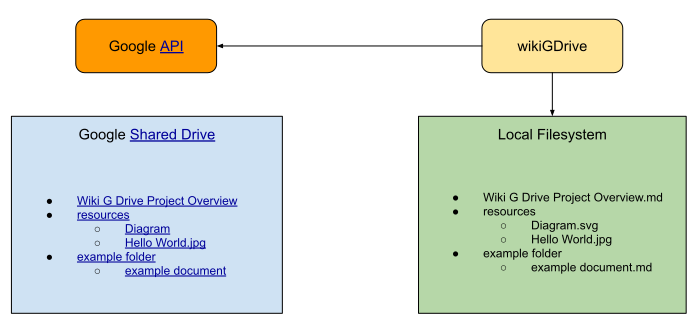

# wikiGDrive

Google Drive to MarkDown synchronization

[](https://circleci.com/gh/mieweb/wikiGDrive)
[](https://lgtm.com/projects/g/mieweb/wikiGDrive/alerts/)
[](https://lgtm.com/projects/g/mieweb/wikiGDrive/context:javascript)

WikiGDrive is a node app that uses the [Google Drive API](https://developers.google.com/drive/api/v3/quickstart/nodejs) to transform Google Docs and Drawings into markdown.



[Google Drive Notes](https://docs.google.com/document/d/1H6vwfQXIexdg4ldfaoPUjhOZPnSkNn6h29WD6Fi-SBY/edit#)
| [Github Project](https://github.com/mieweb/wikiGDrive/projects)
| [Github Developer Notes](doc/developer.md)

With a "Shared Drive" as the key, WikiGDrive:

- Reads all the files from a Google "Shared Drive"
- Builds a map of the driveId (URL) to the pathname in the "Shared Drive"
- For each Google Document:
  - Converts to a Markdown file with the path (instead of the driveId for the file)
  - Changes driveId to the path (eg: 12lvdxKgGsD.../edit would be changed to /filename
  - Supports diagrams as SVG (and map the URLs in the diagram)

WikiGDrive scans for changes in the drive and then refresh the local converted files.

## Building from source

See [Node setup on the system](#Node-setup-on-the-system) for prereq.

```
npm install
npm run build
npm link --local # or node ./dist/main.js
```

## Running as typescript

```
npm install
npm link --local
wikigdrive-ts # or node ./src/cli.ts
```

## Debugging

To get proper sourcemap support we suggest using ts-node for running.

1. Install ndb: `npm install -g ndb`
2. Install ts-node: `npm install -g ts-node`
3. Now you can run it with: `ndb node -r ts-node/register ./src/main.ts ...`
4. Or you can run it with: `ndb node -r ts-node/register/transpile-only ./src/main.ts --dest $DIR pull`
5. Or without the debugger just by `ts-node-transpile-only --project ./src/main.ts --dest $DIR pull`

## Install from NPM

[](https://www.npmjs.com/package/@mieweb/wikigdrive)
[](https://www.npmjs.com/package/@mieweb/wikigdrive)


```
npm i -g @mieweb/wikigdrive
```

## App setup

1. Go to console https://console.developers.google.com/
2. Create New Project
3. Enable Apis -> add Google Drive API
4. Enable Apis -> Add Google Docs API
5. Credentials -> Create Credentials (OAuth Client ID) -> Other ( see authorization section )

## Usage and options

Init workdir with (creates internal .wgd directory):

```
wikigdrive init --drive "https://drive.google.com/drive/folders/FOLDER_ID"

--service_account=wikigdrive.json
--config /location/of/.wgd - Location of config file
--dest /location/of/downloaded/content - Destination for downloaded and converted markdown files

--drive_id - An ID of the drive

--client_id - ID of google app, alternatively can be passed in .env or through environment variable CLIENT_ID;
--client_secret - Secret of google app, alternatively can be passed in .env or through environment variable CLIENT_SECRET;

--link_mode - Style of internal markdown links
--link_mode mdURLs - `/filename.md`
--link_mode dirURLs - `/filename/`
--link_mode uglyURLs - `/filename.html` - see https://gohugo.io/getting-started/configuration/

--without-folder-structure    Download documents into single, flat folder
```

List available drive ids that wikigdrive has access to on Google:

```
wikigdrive drives
```

Run one time documents pull

```
wikigdrive pull
```

Run continuous documents watch

```
wikigdrive watch --git_update_delay=10

--watch - Run program in loop, watch for gdrive changes
--git_update_delay=x - trigger git update hook after x minutes
```

Status

```
wikigdrive status
```

Run server mode for webhooks support (TODO: not implemented yet)

```
wikigdrive server
```

## Example usage with Hugo Generator

1. Install hugo https://gohugo.io/getting-started/quick-start/

2. Create a New Site

```
hugo new site quickstart
```

3. Add a Theme

```
cd quickstart
git init
git submodule add https://github.com/budparr/gohugo-theme-ananke.git themes/ananke
echo 'theme = "ananke"' >> config.toml
```

4. Install wikigdrive

```
npm i -g @mieweb/wikigdrive
```

5. Sync GDrive

```
wikigdrive init --drive "https://drive.google.com/drive/folders/FOLDER_ID" --dest ./content --link_mode uglyURLs
wikigdrive pull
```

Note that by default you need to use `uglyURLs` with Hugo. https://gohugo.io/content-management/urls/#ugly-urls

6. Generate HTML

```
hugo
```

or start server for development:

```
hugo server
```

## Example usage with Hexo Generator

1. Install hexo https://hexo.io/docs/main.html

```
npm i -g hexo-cli
```

2. Create a New Site

```
hexo init quickstart
```

3. Add a Theme

By default, hexo installs `landscape` theme. If you need another one check: https://hexo.io/docs/themes

4. Install wikigdrive

```
npm i -g @mieweb/wikigdrive
```

5. Sync GDrive

```
wikigdrive init --drive "https://drive.google.com/drive/folders/FOLDER_ID" --dest ./source --link_mode uglyURLs
wikigdrive pull
```

6. Generate HTML

```
hexo generate
```

or start server for development:

```
hexo serve
```

## Conflict resolution and redirect algorithm

### Sync stage: get files from google by listening root directory or watching changes - save into google_files.json

### Download stage: download all files that does not exist in download.json - save into download.json

### Transform stage:

0. Get files to transform (does not exist in local_files.json, have different modifiedTime, are trashed), generate desireLocalPaths based on parents
1. If file is removed - remove .md file, remove images
2. If file is new (not exists in local_files.json) - add to localFiles, schedule for generation
3. If file exists but with different desireLocalPath:
   3.1. Remove old .md, remove old images
   3.2. Schedule for generation
   3.3. Generate redir with old localPath
4. Remove dangling redirects
5. Check if there are any conflicts (same desireLocalPath)
6. Check if any conflicts can be removed

## Authorization

There are two methods: individual credentials or a service account.

- [Individual](https://cloud.google.com/docs/authentication/end-user#creating_your_client_credentials)
- [Service Account](https://developers.google.com/identity/protocols/oauth2/service-account#delegatingauthority)

\*\*\*Note: If the authentication is successful, but the account does not have access to documents in gdrive, there is currently no way to know if the directory is empty or just not possible to see.

## FAQ

### What is the purpose of this tool?

To enable collaborative editing of documentation and the ability to publish that documentation as well as linking it to revision control system branches (like in git)

### Why use Google at all. Why not use markdown and GitHub?

No collaboration in real-time. Also, markdown requires skill when managing screenshots and diagrams that are not easily accomplished in markdown.

### Why not just use Google Docs?

Would love it if it were possible, but drive does not offer the ability to publish pages cleanly. The URLs are not SEO friendly. Would love it if there was a driveId map where every document could be given a friendly name (aka its title on the drive). Then (like Wikipedia has disambiguation pages), a reader could be redirected to the proper content. Google doesn’t, so this project is an attempt to fill that gap.

Also, Google does not have a good blame system for contributions to a document. Hopefully this is fixed someday but in the meantime, GitHub on markdown can _help_ fill the void.

### Why markdown?

All ears for a different preferred format. It’s easy to read when editing directly and when doing a diff for changes it’s clean

### What about mismatches in Docs vs Markdown

There are features of Google Docs that are not going to be supported. Like coloring text, page breaks, headers, comments, etc. These features are not core to our goals for clean WYSIYYM.

Keeping a WYSIWYM style ensures a good mobile experience to view and edit.

### Why not make a website front end to a Google shared drive?

Our goals are to be able to take versions of the content and commit them along with a version of the code at a point in time. By just making a website, it would allow for real-time viewing of the content but no way to go to a specific version of the documentation at a given time.

A website front end is a goal for real-time testing of the viewing experience, but initially, we want to make markdown that can be committed.

## Internals

### .wgd dir structure

#### drive.json:

```
{
  "drive": "https://drive.google.com/drive/folders/FOLDER_ID",
  "drive_id": "",
  "dest": "/home/user/mieweb/wikigdrive-test",
  "link_mode": "mdURLs",
  "service_account": "wikigdrive.json"
}
```

#### google_files.json is indexed with Google's fileId - data got from google (just adding parentId, simplify lastAuthor)

### Note this is going away.  Will be replacing this single database with a multi-file version for scale.

- id - Google's fileId
- name - Title set inside google docs. It is not unique
- mimeType - Google's mime type or 'conflict' or 'redirect'
- modifiedTime - Server-size mtime
- localPath - real local path, unique with handled conflicts and redirects (in case of title rename)
- lastAuthor - Google's last author if available

```
{
    "123123123": {
        "id": "123123123",
        "name": "A title of document",
        "mimeType": "application/vnd.google-apps.document",
        "modifiedTime": "2020-02-27T20:20:20.123Z",
        "desiredLocalPath": "a-title-of-document",
        "lastAuthor": "John Smith",
    }
}
```

#### download.json is indexed with Google's fileId - it contains gdoc JSON sources, svg for diagrams and zip with images:

```
{
  "123123": {
    "id": "123123",
    "name": "System Conversion",
    "mimeType": "application/vnd.google-apps.document",
    "modifiedTime": "2020-02-27T21:31:21.718Z",
    "images": [
      {
        "docUrl": "i.0",
        "pngUrl": "https://lh6.googleusercontent.com/123123123123",
        "zipImage": {
          "zipPath": "image1.png",
          "width": 704,
          "height": 276,
          "hash": "0000001101010111101111010010101001010110001011101000111100110111"
        }
      }
    ]
  }
}
```

#### local_files.json is indexed with file id

- desiredLocalPath - slugified name. It is not unique, wikigdrive handles redirects so it is NOT real path in local system
- dirty - file needs to be downloaded
- conflicting - array of fileIds when mimeType = 'conflict'
- localPath - path to transformed markdown file
- modifiedTime - fetched from google server

```
{
    "123123123": {
        "localPath": "a-title-of-document"
        "localPath": "external_path/123123123.png",
        "md5Checksum": "123123123"
    }
}
```

# Node setup on the system

## using OS

```
curl -sL https://deb.nodesource.com/setup_16.x | sudo bash -
sudo apt install nodejs
```

## If you wish to support multiple versions, add n

```
sudo npm install -g n
sudo n 16.15.0
```
