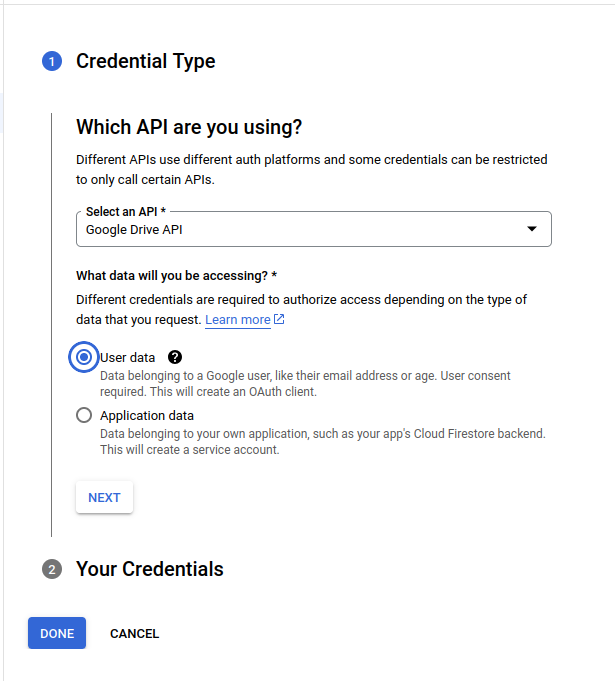

## Install from NPM

*Not currently working*  
See https://github.com/mieweb/wikiGDrive/issues/297 for status.

[](https://www.npmjs.com/package/@mieweb/wikigdrive)
[](https://www.npmjs.com/package/@mieweb/wikigdrive)


```
npm i -g @mieweb/wikigdrive
```

## App setup

Across few years Google changed this process several times.

Here are rough guidelines where to click. They will be probably changed :(.

1. Go to [console](https://console.developers.google.com/)
2. Under project download click 
3. Add Google Drive API 
4. Go to 
5. Click 
6. Select type of data to access 
7. Create 
8. Download 
8. Create 
9. Create 
